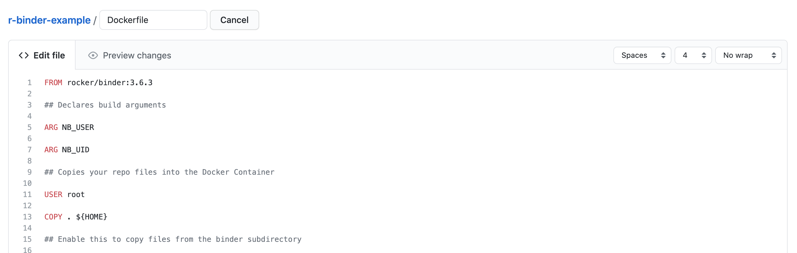
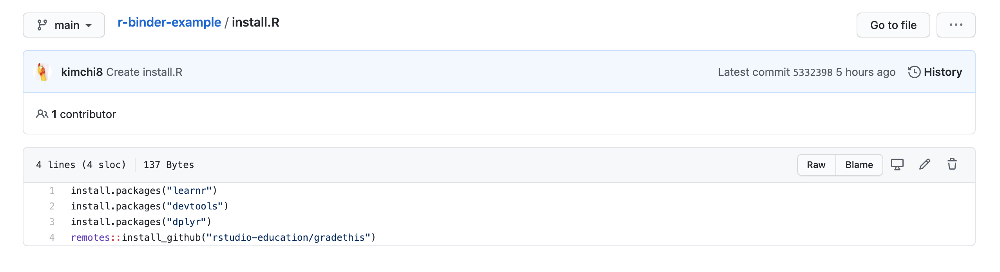

```{r setup, include=FALSE}
knitr::opts_chunk$set(echo = TRUE)
```
```{r klippy, echo=FALSE, include=TRUE}
klippy::klippy('')
```
# Introduction{-}
This tutorial will show you how you can host interactive rmarkdowns for free on myBinder.org. 

## What is myBinder?{-}
Binder is a project that aims to provide a service where people can publish and host their interactive repositories publicly. Binder is capable with many languages include Python, Java, R and Julia. This open-source project provides users the opportunity to access environments without having to manually setup themselves. This is particularly useful for an audience with little code knowledge, or for people who do not necessarily want to spend time setting up dependencies on their own computers, in order to see the markdown. 

A typical binder code repository relies on the content that should be run for the audience to interact with and configuration files which determine the environment binder should run, i.e setting up a RStudio environment or a Python environment etc. In the setup section, we will discuss possible options in which you can create configuration files for Binder. 

### Positives of Binder{-}
* Free open-source hosting service for interactive r documents
* Usable in several languages
* Perfect for reproducible research  

### Limitations of Binder{-}
* Has limited memory space, therefore it is not ideal large data projects
* Each instance only lasts for 12 hours and will die after 10 minutes of inactivity
* Does not store changes made in RStudio i.e saving documents is not possible through Binder.

# Setup Process{-}
To see a working binder example of this tutorial click this badge: 
[](https://mybinder.org/v2/gh/kimchi8/r-binder-example/HEAD?urlpath=%2Frstudio)

The github repository of this example can be accessed [here](https://github.com/kimchi8/r-binder-example).

### Step 0 - Create a Github Repository
Go into Github and create a public repository. Ensure you have a readme folder for readability!

### Step 1 - Create a Dockerfile{-}
Create a Dockerfile on github and use the following code. You can also hide your 
dockerfile by adding .binder/ before you write Dockerfile in the naming section.



```{r dockerfile_template, eval=FALSE, class.source='klippy'} 
FROM rocker/binder:3.6.3

## Declares build arguments

ARG NB_USER

ARG NB_UID

## Copies your repo files into the Docker Container

USER root

COPY . ${HOME}

## Enable this to copy files from the binder subdirectory

## to the home, overriding any existing files.

## Useful to create a setup on binder that is different from a

## clone of your repository

RUN chown -R ${NB_USER} ${HOME}

## Become normal user again

USER ${NB_USER}

## Ensures that the rstudio version will run on Binder
RUN python3 -m venv ${VENV_DIR} && \
    # Explicitly install a new enough version of pip
    pip3 install pip==9.0.1 && \
    pip3 install --no-cache-dir \
         nbrsessionproxy==0.6.1 && \
    jupyter serverextension enable --sys-prefix --py nbrsessionproxy && \
    jupyter nbextension install    --sys-prefix --py nbrsessionproxy && \
    jupyter nbextension enable     --sys-prefix --py nbrsessionproxy

## Run an install.R script, if it exists.
RUN if [ -f install.R ]; then R --quiet -f install.R; fi

```

The tag :3.6.3, refers to what version of RStudio binder should load up. 
* Note that as of 2021, it appears that rocker/binder version >= 4.0.0 has been fairly unstable and does not appear to run RStudio from binder, which is why the template in this tutorial uses version 3.6.3. 

### Step 2 - Create an a install.R File{-}
Create an R script file either on github or if you using version control on RStudio, create a new R script from there. To install and specific dependencies which are available on CRAN use the command:
```{r install_cran_command, eval=FALSE, class.source='klippy'} 
install.packages("packagename")
```

If the dependencies are only available through  github, you will need to first download the devtool commmand and then the github package repository name and author. See below for an example. 
```{r install_github_command, eval=FALSE, class.source='klippy'} 
install.packages("devtools")
remotes::install_github("rstudio-education/gradethis")
```

Ideally you want to have something looking like this:
 

This script can also be stored in the .binder folder if you do not wish for it to be seen when the binder loads. Also note that since this image is built on an older version of Rstudio, some github packages may rely on other packages which are not avaliable in this version. Consider looking into using a runtime.txt file instead (see [here](https://mybinder.readthedocs.io/en/latest/examples/sample_repos.html)

### Step 3 - Hosting on myBinder.org{-} 
Copy your home github repository name into the GitHub repository name or URL section. Ensure you switch the setting to URL mode (see image).   
[set to url mode](images/binder_example_before.png)

Add in /rstudio or ?urlpath=rstudio into the URL to open section. Your setup should look something like this now:
[prelaunch stage](images/binder_example_after.png)

Click launch and wait for the binder to setup. First time initialization take time to build! This can be up to 10 minutes, however if it takes longer this may be due to how many dependencies you have requested in your install.R file, how many markdown files are being loaded etc. To find more ways to speed up your binder consider checking out this link [here](https://discourse.jupyter.org/t/how-to-reduce-mybinder-org-repository-startup-time/4956).

### Step 4 - Sharing{-} 
Congratulations! You have successfully built a binder which is accessible by others. You can share your binder via the url given to you on the myBinder.org site when you were building the document. You can also share it by using a nifty badge. Such options are highlight in the image below.
[sharing options](images/sharing_options.png)


