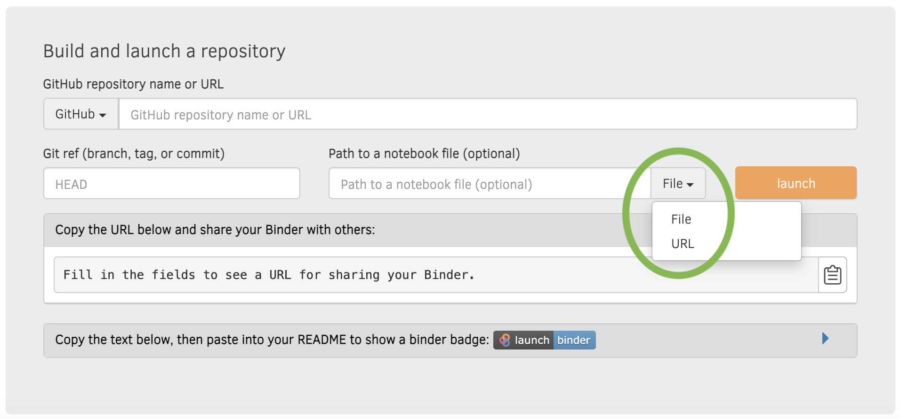
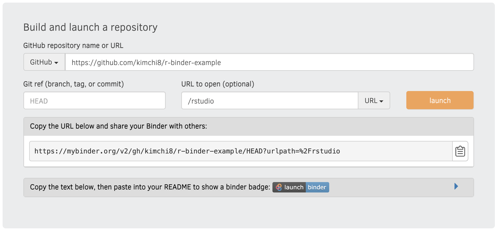
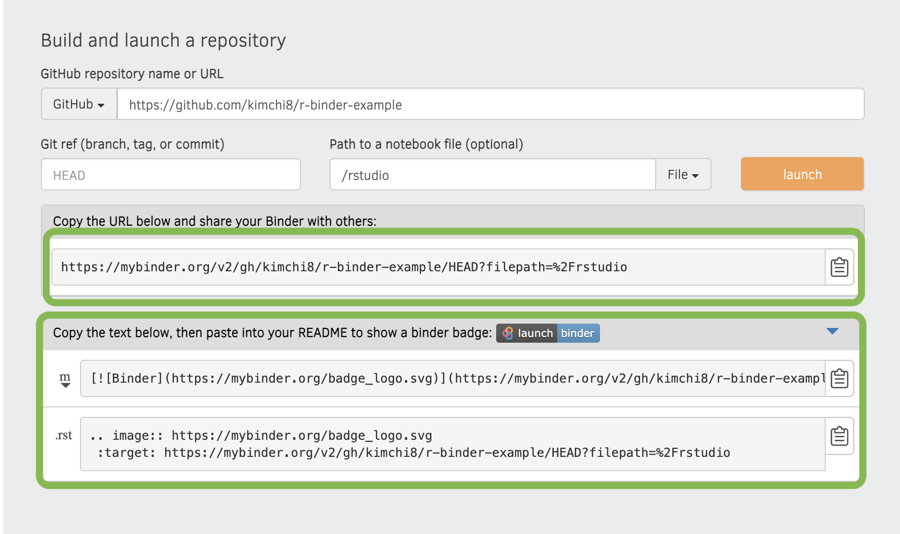

```{r setup, include=FALSE}
knitr::opts_chunk$set(echo = TRUE)
```
```{r klippy, echo=FALSE, include=TRUE}
klippy::klippy('')
```
# Introduction{-}
This tutorial will show you how you can host interactive rmarkdowns and or 
RStudio online for free on myBinder.org. You can also access a video format of 
this tutorial below. 

<center> 
<iframe width="560" height="315" src="https://www.youtube.com/embed/LgzlfDENhXY" frameborder="0" allow="accelerometer; autoplay; clipboard-write; encrypted-media; gyroscope; picture-in-picture" allowfullscreen></iframe>
</center>

## What is myBinder?{-}
Binder is a project that aims to provide a service where people can publish and 
host their interactive repositories publicly. Binder is capable with many 
languages including Python, Java, R and Julia. This open-source project provides
users the opportunity to access environments without having to manually setup
themselves. This is particularly useful for an audience with little coding
background, or for people who do not necessarily want to spend time setting up
dependencies on their own computers. 

A typical Binder github repository has two sections, one being the content that
the audience will interact with and two being the configuration files needed for 
Binder to run the specified environment. 

##### Advantages of Binder{-}
* Free open-source hosting service for interactive R documents
* Available in several languages incluing R, Julia etc
* Perfect for reproducible research  

#####  Limitations of Binder{-}
* Has limited memory space, therefore it is not ideal for larger data projects
* Each instance only lasts for 12 hours and will die after 10 minutes of 
inactivity
* Does not store changes made in RStudio i.e saving documents is not possible 
through Binder.

# Setup Process{-}
To see a working binder example of this tutorial click this badge: 
[](https://mybinder.org/v2/gh/kimchi8/r-binder-example/HEAD?urlpath=%2Frstudio)

The github repository of this example can be accessed [here](https://github.com/kimchi8/r-binder-example).

#### Step 0 - Create a Github Repository{-}
Go into Github and create a public repository. Ensure you have a readme folder for readability!

#### Step 1 - Create a Dockerfile{-}
Create a Dockerfile on github and use the following code template. You can also hide your 
Dockerfile when your Binder is loaded by adding .binder/ before you write 
Dockerfile in the naming section.

\

```{r dockerfile_template, eval=FALSE, class.source='klippy'} 
##RStudio Version is 3.6.3
FROM rocker/binder:3.6.3

## Declares build arguments
ARG NB_USER
ARG NB_UID

## Copies your repo files into the Docker Container
USER root
COPY . ${HOME}

## Enable this to copy files from the binder subdirectory
## to the home, overriding any existing files.
## Useful to create a setup on binder that is different from a
## clone of your repository
RUN chown -R ${NB_USER} ${HOME}

## Become normal user again
USER ${NB_USER}

##Installs version compatible with binder and rstudio version
RUN python3 -m venv ${VENV_DIR} && \
    # Explicitly install a new enough version of pip
    pip3 install pip==9.0.1 && \
    pip3 install --no-cache-dir \
         nbrsessionproxy==0.6.1 && \
    jupyter serverextension enable --sys-prefix --py nbrsessionproxy && \
    jupyter nbextension install    --sys-prefix --py nbrsessionproxy && \
    jupyter nbextension enable     --sys-prefix --py nbrsessionproxy

## Run an install.R script, if it exists.
RUN if [ -f install.R ]; then R --quiet -f install.R; fi

```
* Note that as of 2021, it appears that rocker/binder version >= 4.0.0 has been 
fairly unstable and does not like to run RStudio from binder.3.6.3 is the highest
version that I have found which will run which will run RStudio on Binder. 

#### Step 2 - Create an a install.R File{-}
Create an install.R script either on Github or if you using version control on 
RStudio, create a new R script from there. To install specific dependencies
which are available on CRAN use the command:
```{r install_cran_command, eval=FALSE, class.source='klippy'} 
install.packages("packagename")
```

If the dependencies are only available through  github, you will need to first 
download the devtool pacakge to access the remotes command. Then install the p
ackage by accessing the Github author and package name.
```{r install_github_command, eval=FALSE, class.source='klippy'} 
install.packages("devtools")
remotes::install_github("rstudio-education/gradethis")
```

Ideally you want to have something looking like this:
\
*Note that since Rstudio is in version 3.6.3, some packages may not be avaliable.
For CRAN packages, you can specify the version by using this code template:

```{r install_older_command, eval=FALSE, class.source='klippy'} 
install_version("name", version = "version_date", 
                repos = "http://cran.us.r-project.org")
```

#### Step 3 - Hosting on myBinder.org{-} 
Go to the [Binder](https://mybinder.org/) website. Copy your home github 
repository name into the GitHub repository name or URL section. Make sure 
your repository does not have tree/main and ends with /. Also ensure that you 
switch the setting to URL mode (see image).   
\

Add in /rstudio into the URL to open section. Your setup should look
something like this now:
\

Click launch and wait for the binder to setup. First time initialization
take time to build! This can be up to 10 minutes,  if it takes longer this may 
be due to how many dependencies you have requested in your install.R script or 
how many files are being loaded etc.To find more ways to speed up your binder 
consider checking out this link [here](https://discourse.jupyter.org/t/how-to-reduce-mybinder-org-repository-startup-time/4956).

#### Step 4 - Sharing{-} 
Congratulations! You have successfully built a binder which is accessible by 
others. You can share your binder via the URL given to you on the myBinder.org 
site when you were building the document. You can also share it by using a 
nifty badge. Such options are highlight in the image below.
\


#### Other{-} 
For more information on the gradethis package check out the link 
[here](https://github.com/rstudio-education/gradethis)

For more information on how to create exercises in rmarkdown check out the link 
[here](https://rstudio.github.io/learnr/exercises.html)

# References{-}
@misc{januz2018Dockerfile,
  title        = {binder-works/Dockerfile},
  author       = {januz},
  year         = 2018,
  url          = {https://github.com/januz/binder-works/blob/master/Dockerfile},
}

@misc{januz2018rocker,
  title        = {images built on `rocker/binder` can't run RStudio on mybinder.org #29},
  author       = {januz},
  year         = 2018,
  url          = {https://github.com/rocker-org/binder/issues/29},
  organization = {rocker-org}
}

@book{binder2018documentation,
  title        = {Binder 2.0 - Reproducible, Interactive, Sharable
Environments for Science at Scale.},
  author       = {Jupyter et al},
  year         = 2018,
  url          = {https://mybinder.readthedocs.io/en/latest/index.html},
  publisher    = {Proceedings of the 17th Python in Science Conference.},
  address      = {://10.25080/Majora-4af1f417-011}
}

